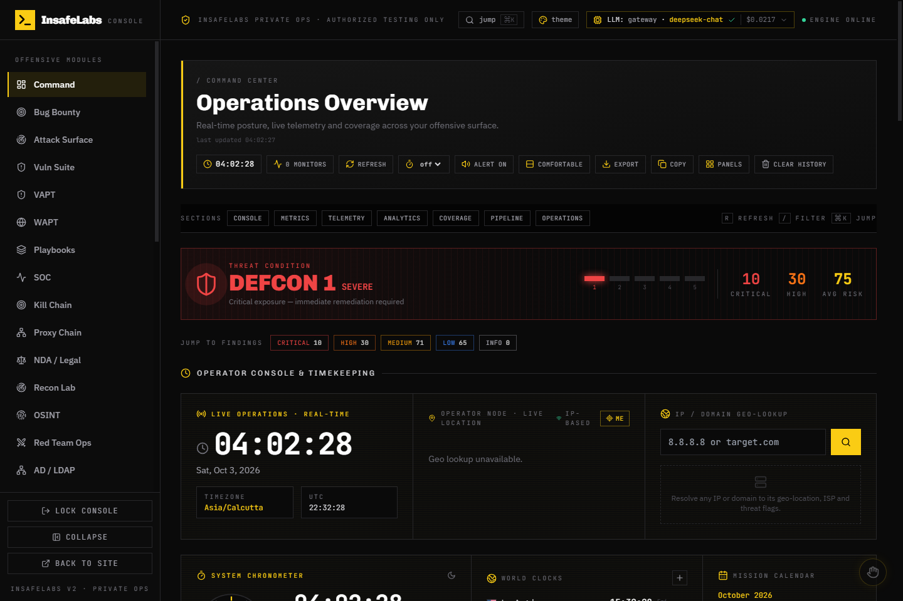
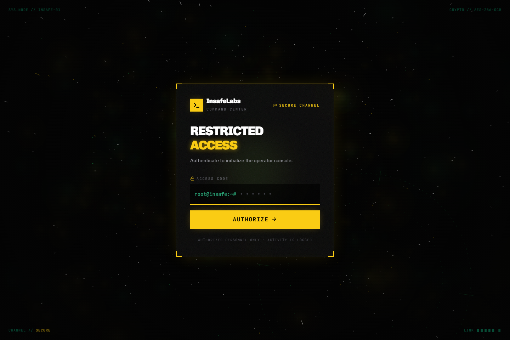
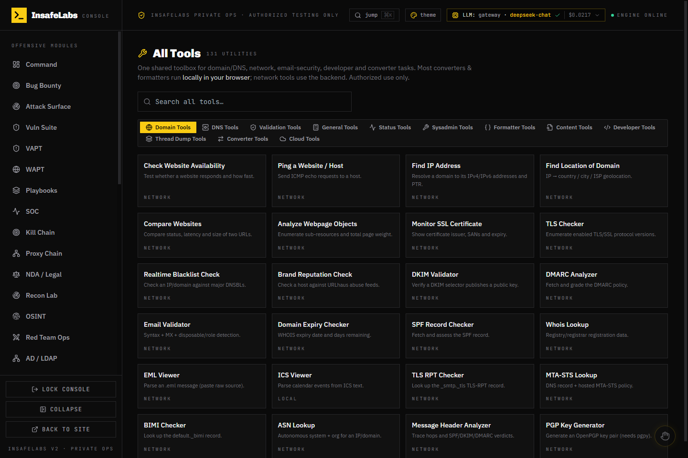
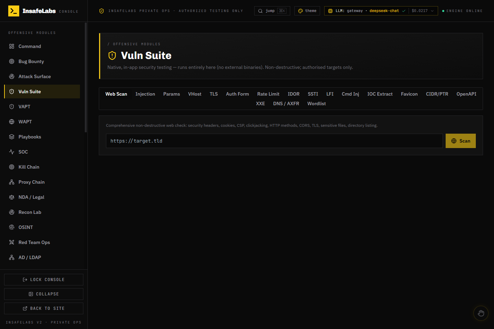
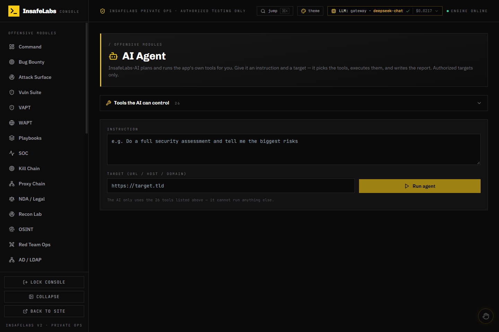
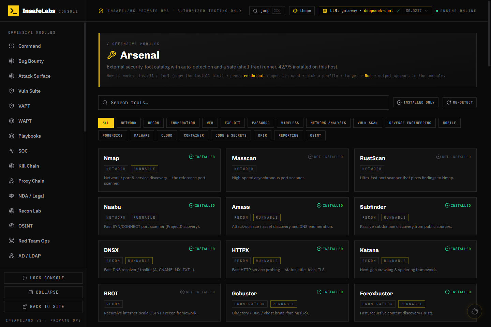

# InsafeLabs — Offensive Security Platform

Full-stack security testing platform: **FastAPI + MongoDB** backend, **React (CRA + CRACO)** frontend.
Local-only by default (localhost) — see [`LOCAL_SETUP.md`](./LOCAL_SETUP.md) for the detailed change log
and hardening notes.



---

## Stack

| Layer     | Tech |
|-----------|------|
| Frontend  | React 18, CRA + CRACO, Tailwind, three.js (3D Agent Arena) |
| Backend   | Python 3, FastAPI, Uvicorn, Motor (MongoDB) |
| Database  | MongoDB on `localhost:27017` |
| AI        | Pluggable LLM backend — DeepSeek (Anthropic-compatible), OpenAI-compatible, or local Ollama |
| Tests     | pytest (`backend/tests/`) |

---

## Project layout

```
.
├── backend/
│   ├── server.py          # FastAPI app entrypoint
│   ├── ai.py              # pluggable LLM backends (gateway / anthropic / ollama)
│   ├── db.py              # Mongo connection
│   ├── netguard.py        # SSRF guard for all outbound fetch tools
│   ├── recon_*.py         # recon library + templates
│   ├── routers/           # 19 API routers (see below)
│   ├── static/            # static assets
│   └── tests/             # pytest suite
├── frontend/
│   ├── src/               # pages, components, hooks, context, lib
│   ├── public/
│   └── package.json       # scripts: start / build / test (craco)
├── LOCAL_SETUP.md         # local setup + change log
├── docs/screenshots/      # README screenshots
└── tests/                 # extra test harness
```

### API routers (`backend/routers/`)

`auth` · `dashboard` · `scanner` · `offensive` · `vulnsuite` · `tools` · `toolkit` ·
`arsenal` · `recon` (`keyrecon`) · `osint` · `pentest` · `redteam` · `bugbounty` ·
`sca` · `agents` · `ai_agent` · `ai_config` · `assessments` · `pentest`

---

## Features

- **Operations Overview** (`/app`) — live telemetry: KPI cards, threat map, DEFCON-style threat
  condition, findings-by-module chart, pipeline panel, trend ranges (7/14d), severity
  quick-filters, export snapshot, auto-refresh (15/30/60s) and a command palette.
- **All Tools** (`/app/all-tools`) — 12 categories, ~131 utilities: domain/DNS, email-security,
  network, validation, formatter, content, developer, thread-dump, converter and cloud tools.
  Converters and formatters run **locally in the browser**; network tools use the backend
  (DNS-over-HTTPS, RDAP/WHOIS, TLS, port and HTTP-header checks).
- **Vuln Suite** (`/app/vuln-suite`) — native, in-app, non-destructive testing: Web Scan,
  Injection (SQLi/XSS/CRLF/open-redirect), **SSTI**, **LFI / path-traversal**, **command injection**,
  Params, VHost, Auth Form, Rate-Limit, **IDOR**, TLS, DNS/AXFR, Wordlist, **IOC extractor**,
  **favicon fingerprint**, **CIDR/PTR sweep**, **OpenAPI analyzer** and **XXE**.
- **AI Agent** (`/app/ai-agent`) — the LLM plans and runs 26 built-in tools, then writes the final
  Markdown report (human-supervised, tool-calling only).
- **Playbooks** (`/app/playbooks`) — one-click multi-step workflows (recon, web-deep, TLS, …).
- **SOC** (`/app/soc`) — health overview, IOC / blacklist watchlist and alerts.
- **VAPT** / **WAPT** (`/app/vapt`, `/app/wapt`) — full web / API assessment engines (OWASP Top 10, PTES).
- **Kill Chain** (`/app/kill-chain`) — MITRE-style phase-by-phase operation map with tool shortcuts.
- **Proxy Chain** (`/app/proxy-chain`) — multi-hop proxy testing and chaining.
- **NDA / Legal** (`/app/legal`) — generate NDA / RoE / scope-letter documents (`.md` + `.pdf`) with auto-fill.
- **Recon Lab** (`/app/recon`) — DNS, SPF/DMARC/DKIM, subdomain enumeration and takeover checks.
- **Arsenal** (`/app/arsenal`) — catalog of **95 security tools** across 19 categories with host
  auto-detection and a strict shell-free (argv-only) runner.
- Plus **AI Pentest**, **Bug Bounty**, **Red Team Ops**, **AD / LDAP**, **Network Map**, **Reverse Eng**,
  **OSINT**, **Crypto Lab**, **Web Inspector**, **Agent Desk** (live 3D operations room), **USB Bridge**,
  **Code Review**, **SCA**, **Findings**, **Operation Report**, **Gesture Control**, **Settings** and **Guide**.
- **Command palette** (`Ctrl/⌘ + K`), accent theme switcher, collapsible sidebar,
  keyboard shortcuts (`R` refresh, `/` focus filter) and an `ErrorBoundary`.

---

## Screenshots

<table>
  <tr>
    <td align="center"><b>Login</b><br></td>
    <td align="center"><b>Operations Overview</b><br></td>
  </tr>
  <tr>
    <td align="center"><b>All Tools — 131 utilities</b><br></td>
    <td align="center"><b>Vuln Suite — 18 native checks</b><br></td>
  </tr>
  <tr>
    <td align="center"><b>AI Agent — 26 tools</b><br></td>
    <td align="center"><b>Arsenal — 95-tool catalog</b><br></td>
  </tr>
</table>

---

## Quick start

```powershell
# 1) Environment files (NOT committed — holds secrets)
copy backend\.env.example backend\.env
#    edit backend\.env → MONGO_URL, DB_NAME, JWT_SECRET (long random),
#    ADMIN_PASSWORD (strong), LLM_BACKEND / LLM_* for the AI key
echo REACT_APP_BACKEND_URL=http://localhost:8001 > frontend\.env

# 2) Install
cd backend; python -m venv venv; .\venv\Scripts\python -m pip install -r requirements-local.txt
cd ..\frontend; npx --yes yarn@1.22.22 install

# 3) Run
cd ..\backend; .\venv\Scripts\python -m uvicorn server:app --host 127.0.0.1 --port 8001
# (new terminal)
cd frontend; $env:HOST="127.0.0.1"; $env:PORT="3000"; npx --yes yarn@1.22.22 start
```

- **Frontend:** http://localhost:3000
- **Backend:** http://127.0.0.1:8001/api/
- **MongoDB** must be running on `localhost:27017`.

---

## Security hardening

- **Auth** — refuses empty `ADMIN_PASSWORD`, rejects empty/oversized passwords,
  lockout keyed on the real IP (`X-Forwarded-For` only trusted with `TRUST_PROXY=1`),
  epoch revocation cache with atomic bump.
- **SSRF guard** (`backend/netguard.py`) on every generic fetch tool — blocks non-http(s),
  cloud metadata endpoints, link-local and loopback/private ranges
  (set `ALLOW_PRIVATE_TARGETS=1` to test internal targets).
- DOM-XSS fix in Leaflet tooltips, `safeHttpUrl()` on attacker-controlled `href`/`src`,
  ADB shell-injection fix, Ollama URL allowlist, escaped scanner PDF fields,
  input caps on wordlists, background scan jobs cancelled on eviction.
- Tests: `backend/test_security_hardening.py` / `backend/tests/` — run with pytest.

---

## Tests

```powershell
cd backend
.\venv\Scripts\python -m pytest tests -q
```

---

## Configuration

| Variable | Where | Purpose |
|----------|-------|---------|
| `MONGO_URL`, `DB_NAME` | `backend/.env` | Mongo connection |
| `JWT_SECRET` | `backend/.env` | token signing (use a long random value) |
| `ADMIN_PASSWORD` | `backend/.env` | admin login (strong, non-empty) |
| `LLM_BACKEND` | `backend/.env` | `gateway` (default) / `anthropic` / `ollama` |
| `LLM_API_KEY`, `LLM_MODEL`, `LLM_BASE_URL` | `backend/.env` | AI gateway key / model / base URL |
| `ALLOW_PRIVATE_TARGETS` | `backend/.env` | `1` to permit loopback/LAN targets |
| `TRUST_PROXY` | `backend/.env` | `1` only behind a trusted reverse proxy |
| `REACT_APP_BACKEND_URL` | `frontend/.env` | backend base URL for the UI |

> `.env` files are git-ignored — never commit them.

---

## Recommended next steps

- Rotate the AI API key and use a strong admin access code.
- Move the auth token out of `localStorage` into an `HttpOnly` cookie for full XSS resilience.

---

## Docs

- [`LOCAL_SETUP.md`](./LOCAL_SETUP.md) — local setup, change log and hardening notes
